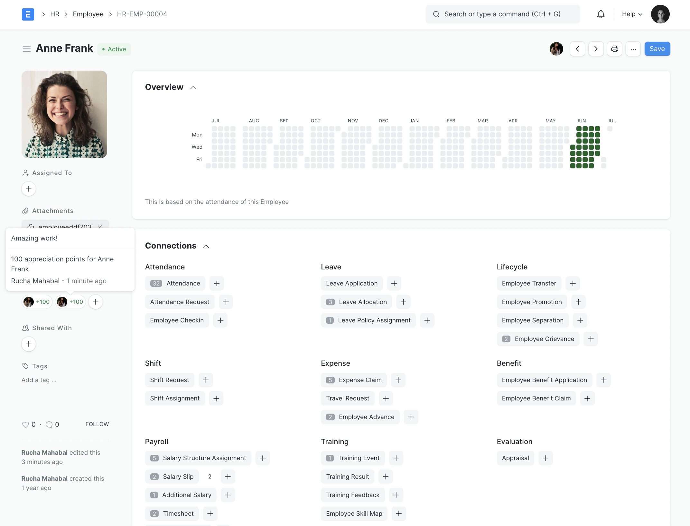

<div align="center" markdown="1">


Open Source, modern, and easy-to-use HR and Payroll Software for all organizations.

[](https://github.com/dontmanage/hrms/actions/workflows/ci.yml)
[](https://codecov.io/gh/dontmanage/hrms)


[https://dontmanagehr.com](https://dontmanagehr.com)

</div>

## Introduction

DontManage HR has everything you need to drive excellence within the company. It's a complete HRMS solution with over 13 different modules right from Employee Management, Onboarding, Leaves, to Payroll, Taxation, and more!



## Key Features

- Employee Management
- Employee Lifecycle
- Leave and Attendance
- Shift Management
- Expense Claims and Advances
- Hiring
- Performance Management
- Fleet Management
- Training
- Payroll
- Taxation
- Compensation
- Analytics

## Installation

1. [Install bench](https://github.com/dontmanage/bench).
2. [Install DontManageErp](https://github.com/dontmanage/bench#installation).
3. Once DontManageErp is installed, add the hrms app to your bench by running

	```sh
	$ bench get-app hrms
	```
4. After that, you can install the hrms app on the required site by running
	```sh
	$ bench --site sitename install-app hrms
	```


## Learning and Community

1. [Documentation](https://dontmanagehr.com/docs) - Extensive documentation for DontManage HR.
2. [User Forum](https://discuss.dontmanageerp.com/) - Engage with the community of DontManageErp users and service providers.
3. [Telegram Group](https://t.me/dontmanagehr) - Get instant help from the community of users.

## Contribute

1. [Issue Guidelines](https://github.com/dontmanage/dontmanageerp/wiki/Issue-Guidelines) - [Create an issue](https://github.com/dontmanage/hrms/issues/new)
1. [Contribution Guidelines](https://github.com/dontmanage/dontmanageerp/wiki/Contribution-Guidelines)

## License

GNU GPL V3. (See [license.txt](license.txt) for more information).

The HR code is licensed as GNU General Public License (v3) and the copyright is owned by DontManage Technologies Pvt Ltd (DontManage) and Contributors.
